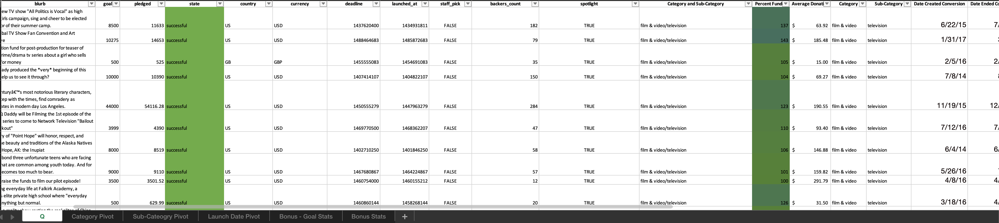
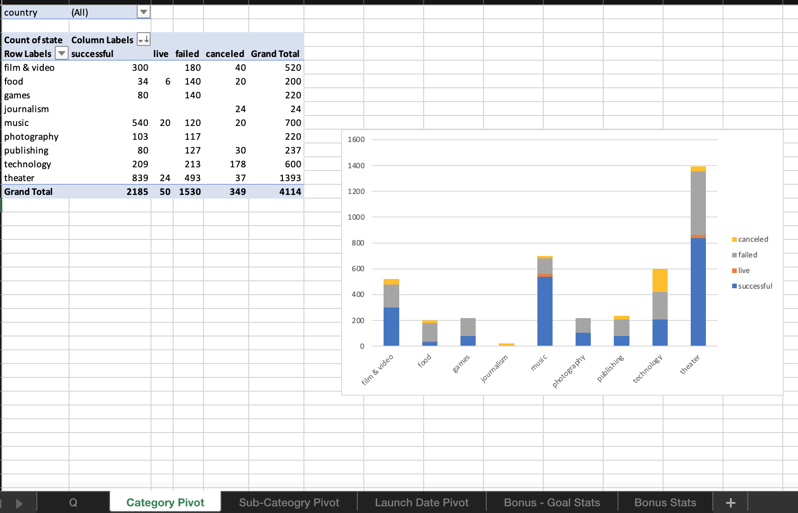
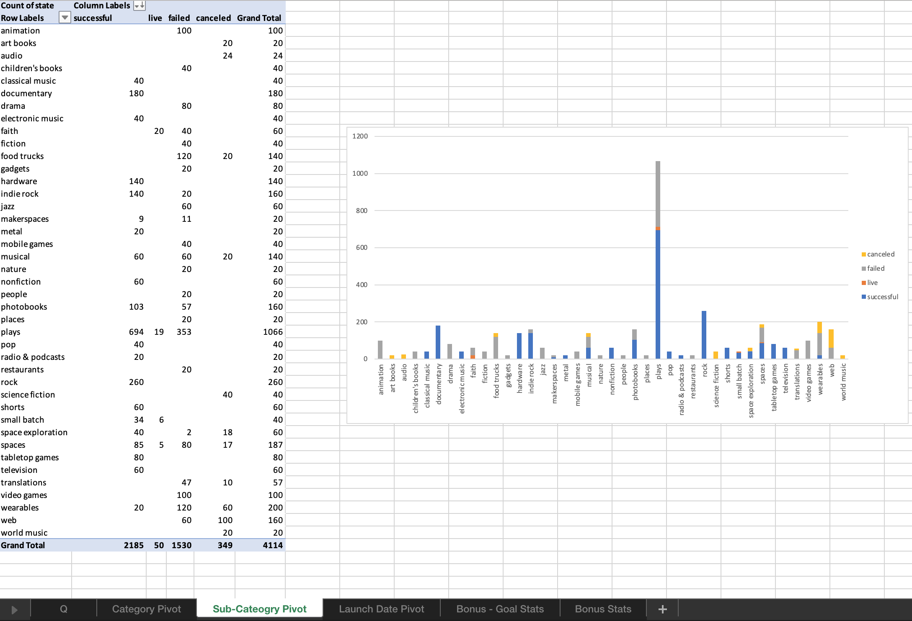
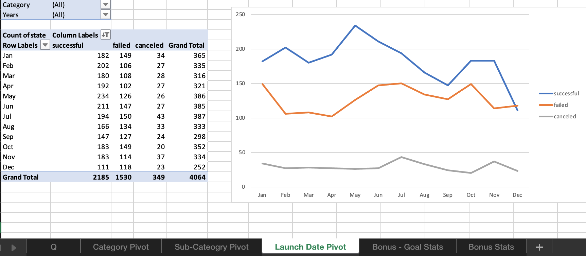
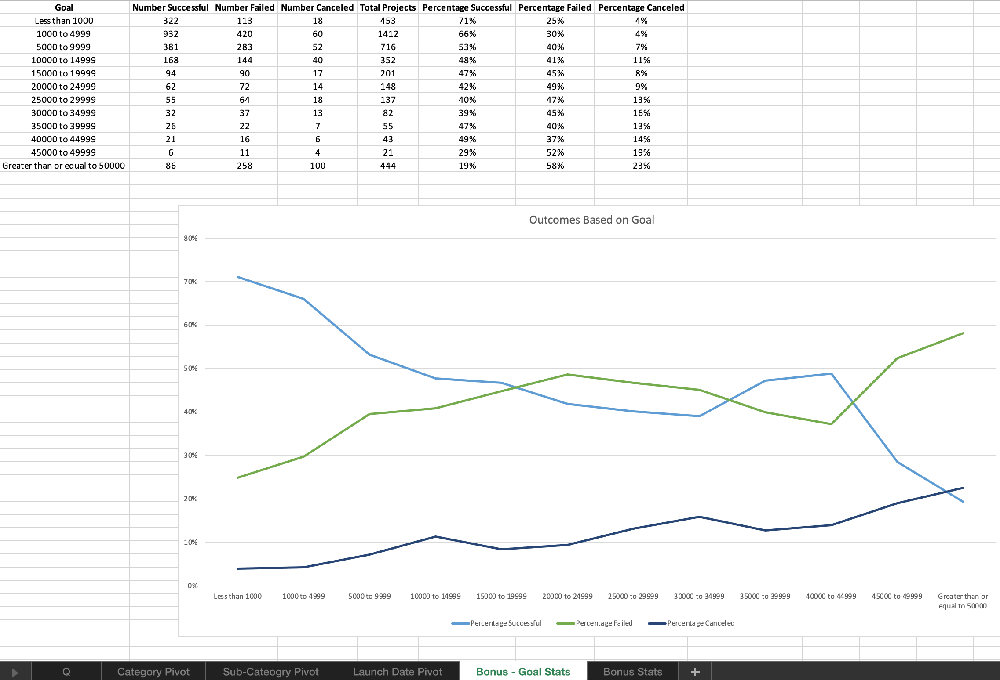

# Excel Project

## Background

Over $2 billion has been raised using the massively successful crowdfunding service, Kickstarter, but not every project has found success. Of the more than 300,000 projects launched on Kickstarter, only a third have made it through the funding process with a positive outcome.

Getting funded on Kickstarter requires meeting or exceeding the project's initial goal, so many organizations spend months looking through past projects in an attempt to discover some trick for finding success. For this project, you will organize and analyze a database of 4,000 past projects in order to uncover any hidden trends.

* Please look at the instructions folder to determine the beginning of the project.

## Analytical Work

Using the data provided, I modified and analyzed the dataset of 4,000 past Kickstarter projects while I attempted to uncover some market trends.

The following excel actions were used: conditional formatting, formulas, text to columns, pivot tables, charts & graphs, timestamps, statistical problem solving, etc. 

## Q - Home Page

* The original dataset was manipulated to color certain cells based on predetermined conditions. 
* Two new columns were created to perform math calculations, then one was also colored based on conditions. 
* Category and Sub-Category needed their own columns and two date timestamps needed to be convertied for furture analysis. 

## Category Pivot

This pivot table will analyze the initial worksheet to count how many campaigns were successful, failed, canceled, or are currently live per **category**.

* The stacked column pivot chart can be filtered by country based on the table created.

## Sub-Category Pivot

This pivot table will analyze the initial worksheet to count how many campaigns were successful, failed, canceled, or are currently live per **sub-category**.

* The stacked column pivot chart can be filtered by country and parent-category based on the table created.

## Launch Date Pivot

This pivot table will analyze the initial worksheet to determine the outcomes based on launch date.

* The line pivot chart can be filtered by years and parent-category based on the table created.

## Bonus Goal Stats

This table was created by using a pre-defined range and mulitple different formulas like countifs, lookups, algebraic equations, etc.

*  The line chart graphs the relationship between a goal's amount and its chances at success, failure, or cancellation.

# Analysis

